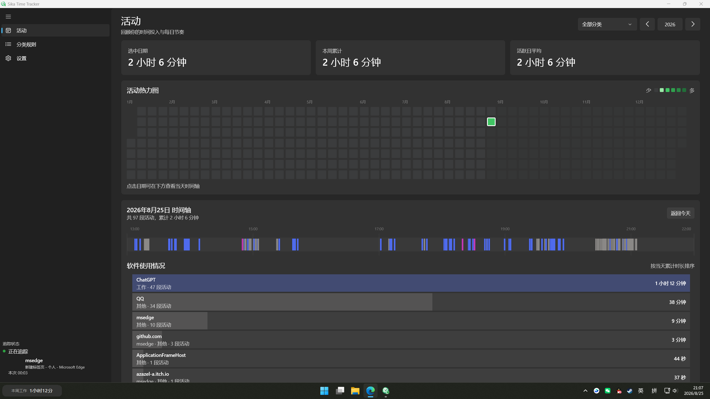

# Sika Time Tracker

> 这是一个写给我自己用的工作打卡软件。

Sika Time Tracker 是一款 Windows 本地时间追踪应用。它自动记录活跃窗口，使用可配置规则进行活动分类，并通过贡献热力图、每日时间轴和软件使用排行展示时间投入。



当前状态：可日常使用。

产品范围与技术方案见 [docs/PROJECT_BRIEF.md](docs/PROJECT_BRIEF.md)。

## 目标平台与技术栈

- Windows 10/11
- C# / .NET 8
- WinUI 3 / Windows App SDK 2.3.1
- SQLite
- MVVM

最终发布为免安装便携版，直接双击 `SikaTimeTracker.exe` 运行。

## 下载与运行

从 [Releases](../../releases/latest) 下载 `SikaTimeTracker.exe`，无需安装，直接双击即可运行。应用仅支持 Windows x64，首次启动会默认最大化。

## 主要功能

- 自动追踪活跃窗口，并在锁屏、睡眠、休眠、切换用户和空闲时停止统计；
- 左下角实时显示当前前台软件、窗口标题和本次连续追踪时长，并以不同颜色区分追踪、AFK、锁屏/休眠和等待状态；
- 在 Windows 任务栏左侧显示本周“工作”分类累计时长；标签会按实际 DPI、分辨率和任务栏尺寸自动定位，也可拖动为悬浮标签，双击后恢复自动贴回任务栏；
- 使用 SQLite 在本机保存活动段、分类、规则和设置；
- 每个分类直接维护一组正则表达式，同时匹配进程名称与窗口标题；
- GitHub 风格绿色年度热力图、分类筛选、时间汇总和可交互的图形时间轴；
- 时间轴自动裁掉首条活动前与末条活动后的空白，并以最少行数分开展示重叠区段；
- 图形时间轴下方按当天累计时长展示软件使用排行，并以水平柱状图直观比较；
- 浏览器活动可按当前网页域名归类，支持 Edge、Chrome、Firefox、Brave、Opera、Vivaldi 和 Arc；
- 热力图在宽窗口中自适应放大，在窄窗口中保持可读尺寸并支持横向滚动；
- 活动页仅在前台可见时每 30 秒自动刷新，活动段结束时也会立即更新；
- 修改分类规则后，会自动重新分类未手动修正的历史记录；
- Fluent Design 界面、浅色/深色主题、系统托盘和开机自启动；
- 离开设置页前检测未保存更改，并提供保存、放弃或取消导航；
- CSV 导出、活动数据清理和“仅记录进程名称”隐私模式。
- 默认不记录 Explorer 与 Sika Time Tracker 自身，并隐藏已有的同类活动。
- 最短记录时长默认 15 秒；活动页会按当前设置隐藏更短的历史活动。

## 开发与测试

要求 Windows 10 1809 或更高版本，并安装 .NET 8 SDK。

```powershell
dotnet restore SikaTimeTracker.sln
dotnet build SikaTimeTracker.sln --configuration Debug
dotnet test SikaTimeTracker.sln --configuration Debug
```

开发构建使用 self-contained Windows App SDK。可执行程序位于：

```text
src\SikaTimeTracker.App\bin\x64\Debug\net8.0-windows10.0.19041.0\SikaTimeTracker.exe
```

## 生成便携版

```powershell
.\scripts\publish.ps1
```

发布脚本会先运行测试，再生成 x64、免安装、self-contained 的单文件程序：

```text
artifacts\publish\win-x64\SikaTimeTracker.exe
```

WinUI 3 的单文件发布会在首次运行时将依赖释放到系统临时目录，这是 Windows App SDK 的标准行为。

## 使用说明

- 启动后会始终自动追踪，不提供手动暂停；左侧底部可查看当前软件和本次连续追踪时长。
- 任务栏状态标签每 15 秒刷新本周工作时长；点击可打开或最小化主窗口，拖动可保存自定义位置，双击恢复自动贴回任务栏。全屏应用或自动隐藏的任务栏收起时，标签会自动隐藏。
- 点击热力图日期可查看当天时间轴；悬停活动段可查看详情。下方软件使用情况按当天累计时长排序，点击汇总项可查看当天明细，并按整个程序或网站域名修改分类。
- 分类规则页按分类维护正则列表，每行一个表达式；保存后会自动重新分类未手动修正的历史记录。
- 关闭主窗口后应用继续在系统托盘运行；需要彻底退出时使用托盘菜单“退出”。
- 数据库默认位于 `%LOCALAPPDATA%\SikaTimeTracker\activity.db`。
- CSV 默认导出到“文档\SikaTimeTracker”。
- 便携 EXE 被移动后，如已启用开机自启动，请在设置中关闭并重新开启一次。

## 隐私原则

所有活动数据默认仅保存在本机。软件不会记录键盘输入、截图或网页内容，也不会在未经用户明确操作的情况下上传窗口标题、进程信息或网站域名。

浏览器域名通过读取当前窗口地址栏获得，只有启用“记录窗口标题与网站域名”时才会保存；关闭该设置后只记录进程名称。

## 开源协议

本项目使用 [WTFPL v2](LICENSE) 开源协议。Do What The Fuck You Want To.
